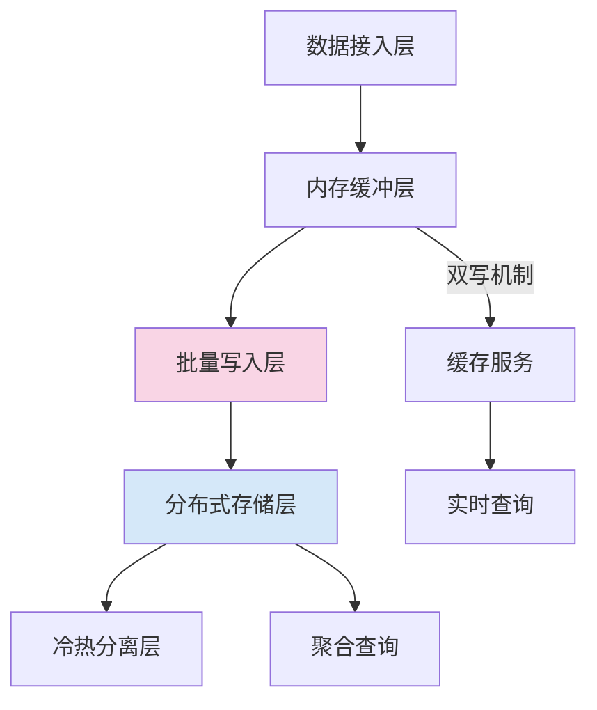

# 区块链行情数据处理专业面试问题

## 数据采集方向
1. 如何设计多交易所行情数据的并发采集系统？请说明WebSocket连接池管理方案

**解决方案：**
采用分层架构设计实现高并发采集系统：
- **连接管理层**：基于Go的goroutine实现轻量级线程池，每个交易所独立维护连接池
- **协议适配层**：使用状态机模式处理不同交易所的协议差异（如Binance的`depth@100ms`与FTX的`orderbook_100ms`）
- **流量控制层**：实现滑动窗口算法动态调整请求速率
- **异常恢复层**：具备自动重连机制和断线补偿策略

**WebSocket连接池关键技术：**
- 动态扩容机制：根据消息吞吐量自动调整连接数
- 心跳保活策略：多级心跳检测（应用层15s + TCP层30s）
- 连接复用优化：支持TLS会话票据复用降低握手开销
- 负载均衡策略：基于交易所响应延迟动态分配请求

2. 面对交易所API的请求频率限制，有哪些优化采集效率的可行方案？

**优化方案矩阵：**

| 策略类型        | 实现方式                                                                 | 适用场景              |
|----------------|------------------------------------------------------------------------|---------------------|
| 分级调度策略    | 将订单簿（高频）与成交记录（低频）分离处理                                | 多数据类型采集场景    |
| 智能节流算法    | 基于卡尔曼滤波器预测最优请求间隔                                         | 动态限速场景          |
| 数据分片采集    | 按交易对哈希分片到不同采集节点                                           | 大规模交易对场景      |
| 增量更新轮询    | 使用`LastUpdateId`等标记实现增量获取                                     | 支持版本控制的API     |
| 缓存复用机制    | 建立LRU缓存池复用高频查询结果（有效期内）                                 | 静态数据查询场景      |

3. 如何处理区块链行情数据的异构性问题（不同交易所数据格式差异）？

**标准化处理流程：**
1. **协议特征识别**
   - 建立协议指纹库（心跳间隔、字段命名风格、数值精度特征）
   - 使用有限状态机自动识别未知协议格式

2. **数据转换阶段**
   - 数值标准化：统一精度处理（如BTC价格统一保留8位小数）
   - 时间对齐：转换时区并统一为Unix毫秒时间戳
   - 字段映射：通过配置化规则引擎实现动态转换

3. **质量验证机制**
   - 数值范围校验（价格波动率<10%/分钟）
   - 时序连续性校验（时间戳递增检测）
   - 买卖价差合理性校验（bid/ask价差阈值控制）

**异常处理策略：**
- 建立分级报警机制（字段缺失→数据失真→连接中断）
- 实现自动容错转换（默认值注入+问题标记）
- 维护协议特征库的版本化管理

## 数据解析方向
4. 如何实现实时行情数据的快速反序列化？请对比Protocol Buffers与JSON的性能差异

**技术方案对比：**

| 维度            | Protocol Buffers                          | JSON                              |
|----------------|-------------------------------------------|-----------------------------------|
| 序列化速度       | 比JSON快5-10倍（二进制编码）               | 较慢（文本解析开销）               |
| 数据体积         | 减少50-70%（无冗余字段）                   | 较大（包含字段名等元数据）          |
| 内存占用         | 低（支持零拷贝解析）                       | 高（需构建完整对象树）              |
| 协议扩展性       | 强（支持字段版本控制）                     | 弱（需保持向后兼容）                |
| 适用场景         | 高频交易场景（>10万QPS）                  | 低频配置场景（<1万QPS）            |

**优化策略：**
- 采用预编译的序列化模板
- 实现内存池复用反序列化对象
- 使用SIMD指令加速文本解析
- 建立热数据缓存区减少IO压力

5. 设计异常数据过滤机制时应考虑哪些关键指标？如何实现数据有效性验证

**关键检测指标：**
1. 数值合理性
   - 价格波动率阈值（如±10%/分钟）
   - 买卖价差范围（如>0.1%触发预警）
2. 时序连续性
   - 时间戳单调递增检测
   - 数据版本号连续性校验
3. 关联一致性
   - 订单簿买卖总量平衡校验
   - 最新成交价与订单簿价差关联

**三级验证机制：**
- 预处理层：基于规则引擎快速过滤（正则匹配/范围过滤）
- 核心层：统计模型检测（Z-Score异常值检测）
- 后处理层：时序相关性分析（ARIMA模型预测偏差）

6. 如何处理交易所推送的深拷贝(deep copy)数据与增量更新数据的解析差异？

**差异处理策略：**
1. 数据模式识别
   - 深拷贝数据：完整订单簿快照（包含`sequenceId`）
   - 增量数据：差异事件集合（包含`prevSeqId`和`nextSeqId`）

2. 同步机制设计
   - 快照基准线：每小时存储完整订单簿状态
   - 增量回放：基于事件时间窗口（通常100-500ms）
   - 状态修复：当检测到seqId断层时触发快照重载

3. 一致性保障
   - 版本对齐：维护全局sequenceId映射表
   - 缓冲队列：实现500ms滑动窗口处理乱序数据
   - 差异补偿：当数据丢失超过窗口大小时触发快照同步

## 数据存储方向
7. 如何设计时序数据库存储方案以支持高频行情数据的快速写入与查询？

**高性能存储方案设计：**

**关键技术实现：**
- **存储引擎优化**
  - 采用LSM-Tree结构提升写入吞吐（如InfluxDB TSM引擎）
  - 列式存储压缩（ZSTD算法压缩比达10:1）
  - 时间分区策略（按小时/分钟分片）
  
- **索引设计**
  - 多级索引结构（主索引时间戳+辅助索引交易对）
  - 布隆过滤器加速存在性判断
  - 倒排索引实现快速维度查询

- **查询优化**
  - 预聚合技术（1分钟/5分钟K线预计算）
  - 向量化执行引擎加速分析查询
  - 智能缓存热点数据（LRU-K算法）

8. 针对tick级行情数据，请说明ClickHouse与PostgreSQL的存储优化策略差异

**存储优化策略对比：**

| 优化维度        | ClickHouse                                      | PostgreSQL(TimescaleDB)                |
|----------------|-------------------------------------------------|-----------------------------------------|
| 数据分片        | 自动分片（Distributed表引擎）                    | 手动分片（Hypertable分区）               |
| 压缩算法        | 列级LZ4/ZSTD压缩（压缩比5-10x）                  | 段级压缩（压缩比2-3x）                    |
| 索引机制        | 稀疏索引+主键排序                                | B-tree/GIN索引                           |
| 写入优化        | 大批量（>1000行）异步写入                        | 事务批量提交（每次<1000行）               |
| 内存管理        | 自主内存池管理（避免OOM）                        | 依赖操作系统缓存                          |
| 典型吞吐量      | 50-100万行/秒                                  | 5-10万行/秒                             |

**场景选择建议：**
- ClickHouse：适合实时分析、高频聚合查询场景
- PostgreSQL：适合复杂事务、ACID要求严格场景

9. 如何实现分布式存储场景下的数据一致性保障机制？

**一致性保障体系：**

**核心机制：**
1. **数据分片策略**
   - 一致性哈希算法实现动态扩缩容
   - 多副本放置策略（跨机房/区域）

2. **副本同步机制**
   - Quorum写入协议（W+R>N）
   - 基于Raft的日志复制
   - 反熵协议修复数据差异

3. **冲突解决方案**
   - 向量时钟跟踪因果关系
   - Last-Write-Win时间戳裁决
   - 业务自定义合并函数

4. **监控体系**
   - 数据校验和（CRC32）
   - 端到端一致性巡检（对比不同副本）
   - 数据修复看板（实时显示差异率）

